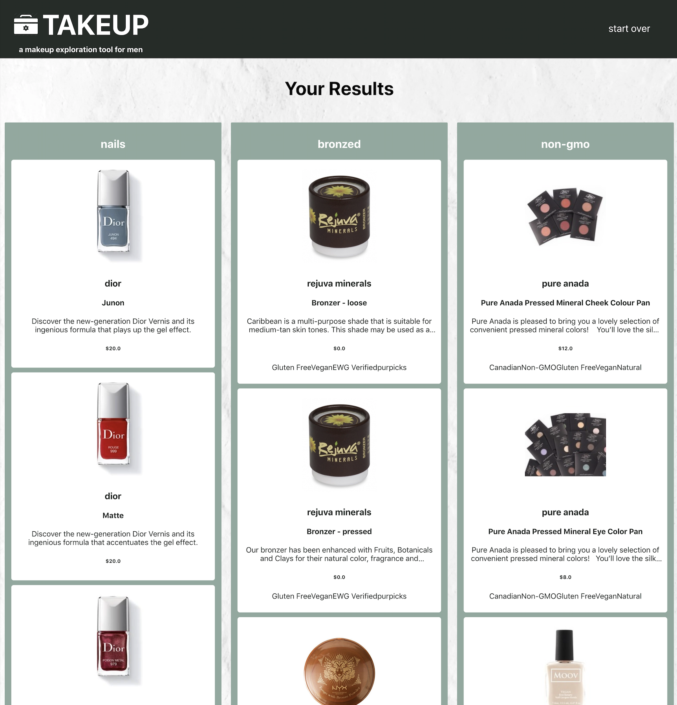

# TAKEUP

TAKEUP is an introductory makeup tool designed for men interested in exploring the wide world of cosmetics. The application allows visitors to provide their specific curiosities and then serves up product data related to these interests. Reducing the noise TAKEUP displays a limited number of search results within an easy to navigate guided user interface.

Planned, designed, built and tested as an individual project over the course of five days TAKEUP utilizes React to handle user interactions and Redux to store and direct application data. User flow managed with React Router guides the visitor on a private tour through their custom cosmetic experience. Asynchronous JavaScript fetch calls have been implemented with loading and error handling to ensure an engaged user experience throughout active network requests. An Enzyme/Jest testing suite accompanies the program.


## Technologies Utilized

 - React
 - React Router
 - Redux
 - [Makeup API](http://makeup-api.herokuapp.com/) fetch network requests
 - PropTypes
 - Enzyme/Jest
 - CSS


## Setup

Clone down the UI repository.

Install the application's dependencies from within the cloned directory:
```bash
npm install
```

Then launch the application within the browser:
```bash
npm start
```

Open [http://localhost:3000](http://localhost:3000) to view the application in your browser.


## Testing

Application components and routes have been tested using various unit testing techniques including snapshots, class method and functional, asynchronous, Router, and Redux testing. 

```bash
npm test
```

## Developer

 - Alyssa Lundgren [@lundgrea](https://github.com/lundgrea)


## Screenshots



